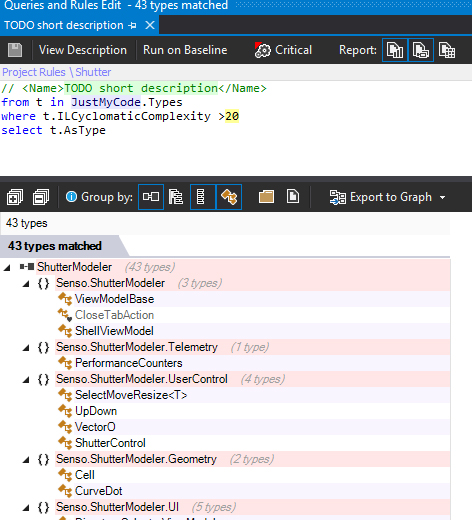

# Review: Ndepend 2017.3

After using Visual studio enterprise (VS) and Resharper (R#) on c# programs a while, following design patterns such as [**MVVM**](https://msdn.microsoft.com/en-us/magazine/dd419663.aspx), [**DI**](https://stackoverflow.com/questions/130794/what-is-dependency-injection), we might want to have a more precise overview of the application being developed. But not Visual studio enterprise nor Resharper can give any significant, relevant view on the code and what it does, and how well, how ideas are organized, etc.

I have a medium - big sized progam involving both [**computer vision**](http://news.mit.edu/topic/computer-vision) and **realtime image/video editing**; it involves c#, c++, matlab, [MKL](https://software.intel.com/en-us/mkl), [cuda](https://developer.nvidia.com/cuda-faq) code, but most of it is **c#**; it has about 10k LOCs, has a computing part and a graphical user interface (GUI) part, it has **MVVM** pattern, and uses [**Prism**](https://github.com/PrismLibrary/Prism) and [**Unity**](https://msdn.microsoft.com/en-us/library/dn223671(v=pandp.30).aspx) for **DI** patterns; it has unit tests, even though it's not [**TDD**](http://agiledata.org/essays/tdd.html); it has metrics for performance measurements in many critical places.

I often have the practice of having everything in mind and then I write code. In other words, I have the global ideas and architecture in mind as I code and craft my local ideas. With such a project, I needed some time to just have the global feeling back again (and yes, I was sometimes having hard times reading my own code after being awhile AFK). Hum. Not that good, but I have no means to know if it was me or my implementation.

I have a quite big **ViewModel** class, which is classical, with implementation in several files (partial public class), for different aspects.

Question: is having a big class (big: many fields, many methods) a code smell despite I'm following the MVVM pattern ?

## Why and when Ndepends ? Ndepends gives qualitative eyes

The core of an enterprise is to solve a problem. What does Ndepend solves ? Its gives instant qualitative eyes on code without the need to read the code (what ever its size), and this helps to improve code quality as well as architecture.

When it is hard to have immediate vision of the quality of all the code, or at least a vision of the code in its context (not the code written, but the code in its usage in the program), when we need to see the code from a certain point of view, through a certain filter, here comes the need of Ndepend, as static code analyser to understand better differents aspects of the program, and have quite specific requests about the code.

The best analogy I have about what Ndepends does is **operators** in quantum physics, which correspond to **observables**: we have a complex object which is "totally described" by a wave function, but this wave function doesn't give us a proper feeling about what is happening to the quantum object (atom, molecule ...). What do we do ? we apply an operator to get a measure about a certain aspect of the quantum object (~ program), and this measure (eg, energy) is experimentally verifiable, and it means something for the human. We don't know anything else, and we don't need anything else. The difference is that Ndepend doesn't change the state of our program.

Ndepend's operators are LINQ requests over the code: [CQLINQ](https://www.ndepend.com/default-rules/webframe.html).

Ndepend is quite rich and has many already implemented **rules**, **quality gates**, and **issues**. Those rules are extremely readable and totally transparent: they are open source, they are commented and explained, they can be changed, eg., to match our interpretation of **too big**, and _we can implement new ones_ !

 In version 2017.2 there was many "false positives", and it was corrected in 2017.3, but actually all those metrics, thresholds are kind of personnal and depend on your style, organization needs, and so on.

## How does Ndepend work ? Ndepend's core is to linq the code: CQLINQ

c# is amazing. [LINQ](https://docs.microsoft.com/en-us/dotnet/csharp/programming-guide/concepts/linq/introduction-to-linq-queries) is amazing. [CQLINQ](https://www.ndepend.com/default-rules/webframe.html) is amazing.

c# is an amazing language to read, write and craft, for the sake of the language, but also thanks to the ecosystem: IDEs, libraries, [SO](https://stackoverflow.com/questions/tagged/c%23) (stack overflow), support, the compiler [Roslyn](https://github.com/dotnet/roslyn) being open source. c# is amazing. Linq is amazing: well written, flexible, simple and extremely powerful. The core of Ndepend is to do Linq over our code (rules) and to have a GUI over that to present the results, which can be instantaneous as well as dynamic, ie, how those metrics evolve in time, as trends as we code.

Ndepend is totally transparent about the requests (rules, quality gates and issues), which can be modified according to our needs and tastes, which are explained: Ndepend provides **description** of the rule and **how to fix**.

Let's have here an example, a code smell rule called "Avoid types with too many methods":

One neat thing about the editing of CQLINQ is that there is intellisense for the query AND we got the result of the query being constructed as we type. This is really helpful to craft a rule, since this is definitely an empirical art.

## The analysis power of Ndepend

## Ideas of future evolution of Ndepend

### Automation on code refactoring

I would love to be able to ask to Ndepend to (semi-)automatically refactor my code to solve the bad metrics and improve the code. Actually it eventually goes beyond refactoring when the architecture is changed, and refactoring is not supposed to affect the architecture.

The power of Resharper is to be present to the developer as we write the code.

### Realtime local metrics

Let's say I'm working on a specific type or function. I'm might find useful to have realtime updated metrics about my code and its integration with the rest of the project. Hence I would have local metrics about the just written code, in the context of more global metrics. That would be funny, and closer to the writter than to the architect; which make sense since the trend is to have scrum practices and flatter responsabilities and hierarchy.

### More interactivity

The UXUI is a bit clumsy-heavy when it's about navigating among rules. There was definitely improvements with 2017.3, getting closer to the user with guiding messages.

I wish I could remove the sound (or customize it).

I wish my rules were remembered, after restart of VS.

### Market place of rules and code crafting

There are many existing rules and we can tune them, add new ones indeed. But:

* it might take to time to know where to go with the rules: tune them, pick the most relevant to the project;
* rules and sets of rules might depend on style, on project, etc;
* and depending on the project we might need to adapt them, select them and share our custom set of rules.

Having a small set of custom rules, coming from users and Ndepend, might be useful to have quick start, since Ndepend needs to be learnt before expressing its power.

