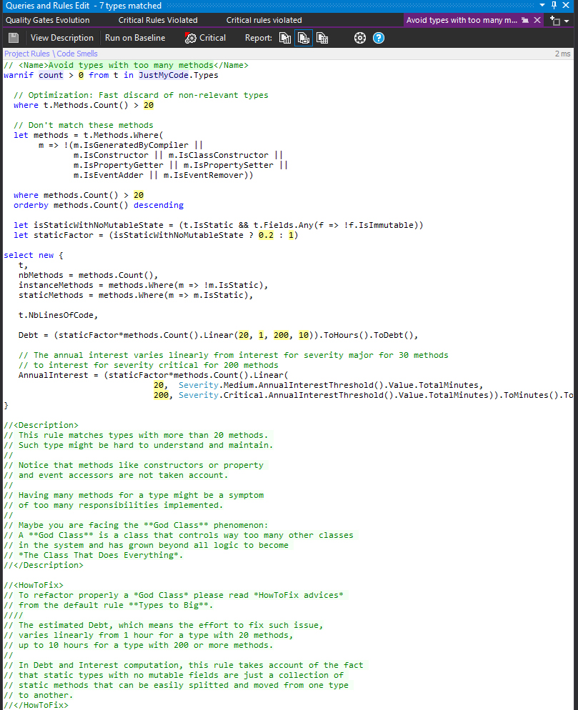
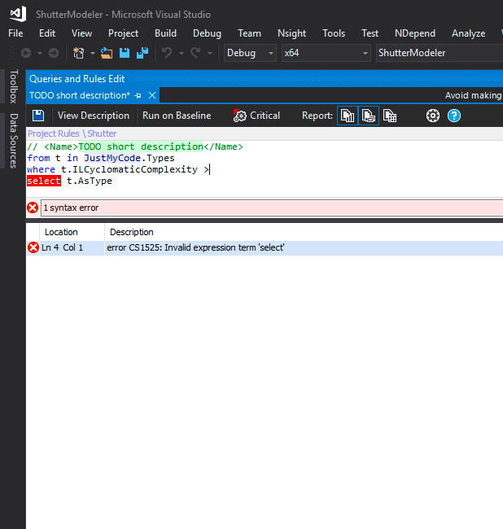
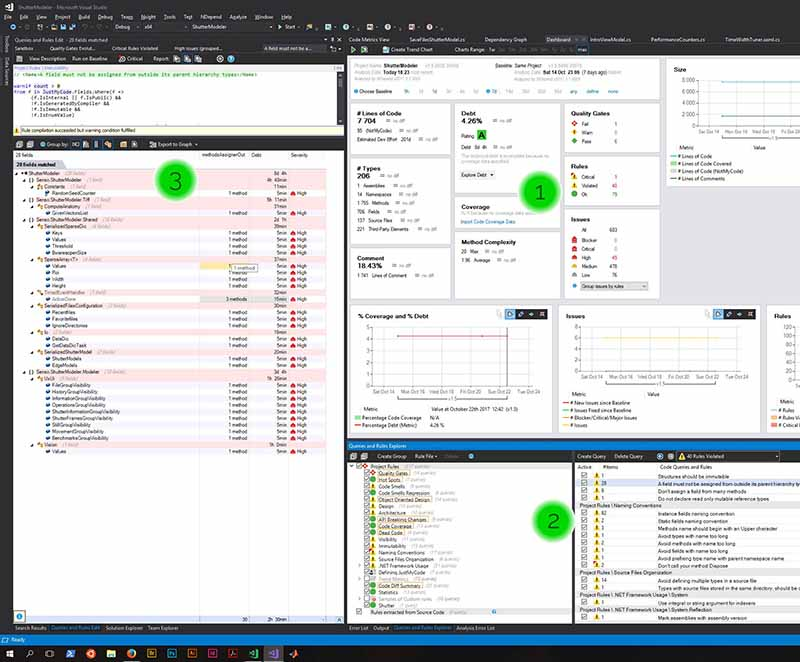
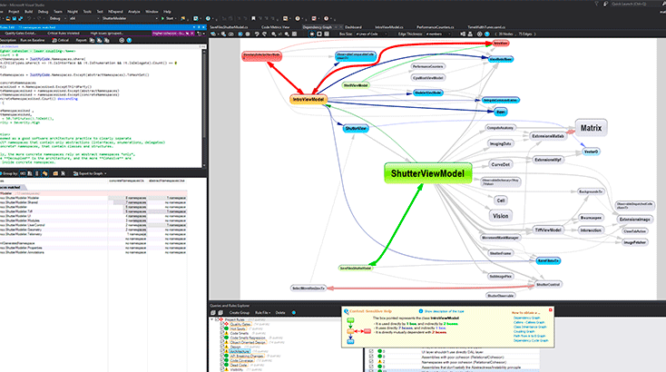
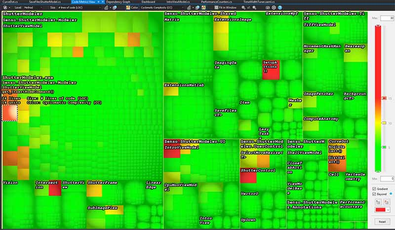

# Review: Ndepend 2017.3

### Abstract

Ndepend provides CQLINQ ie., LINQ requests on c# code to give open, editable, documented, customizable metrics, and presents them in different ways (graphs, matrix, tree list) so the developer, architect, have instantaneous insight of the code qualities and their trends, so they know how well a software is being implemented. Metrics come with human engineering metrics: debts and interests. Ndepends goes way beyond refactoring and is the most complete featured static code analyst on the market today.

Here I won't review all features of Ndepend, but attempt to get the essence of Ndepend and bolden its qualities and flaws in the context of the development of a certain software.

### Context

After using Visual studio enterprise (VS) and Resharper (R#) on c# programs a while, following design patterns such as [**MVVM**](https://msdn.microsoft.com/en-us/magazine/dd419663.aspx), [**DI**](https://stackoverflow.com/questions/130794/what-is-dependency-injection), we might want to have a more precise overview of the application being developed. But not Visual studio enterprise nor Resharper can give any significant, relevant view on the code and what it does, and how well, how ideas are organized, etc.

I have a medium-big-sized progam involving both [**computer vision**](http://news.mit.edu/topic/computer-vision) and **realtime image/video editing**; it involves c#, c++, matlab, [MKL](https://software.intel.com/en-us/mkl), [cuda](https://developer.nvidia.com/cuda-faq) code, but most of it is **c#**; it has about 10k LOCs, has a computing part and a graphical user interface (GUI) part, the latter involving **WPF**, it has **MVVM** pattern, and uses [**Prism**](https://github.com/PrismLibrary/Prism) and [**Unity**](https://msdn.microsoft.com/en-us/library/dn223671(v=pandp.30).aspx) for **DI** patterns; it has unit tests, even though it's not [**TDD**](http://agiledata.org/essays/tdd.html); it has metrics for performance measurements in many critical places.

I often have the practice of having everything in mind and then I write code. In other words, I have the global ideas and architecture in mind as I code and craft my local ideas. With such a project, I needed some time to just have the global feeling back again (and yes, I was sometimes having hard times reading my own code after being awhile AFK). Hum. Not that good, but I have no means to know if it was me or my implementation.

I have quite a big **ViewModel** class, which is classical, with implementation in several files (partial public class), for different aspects.

Questions: is having a big class (big: many fields, many methods) a code smell despite I'm following the MVVM pattern ? Do I have ways to know better my code qualities and problems ?

## Why and when Ndepends ? Ndepends gives qualitative eyes

The core of an enterprise is to solve a problem with social impact. What does Ndepend solve ? It gives instant qualitative eyes on code without the need to read the code (whatever its size), and this helps to improve code quality as well as architecture, engineering practices and monitor its evolution. This works just in time and through remembering metrics, we can get trends.

When it is hard to have immediate vision of the quality of the entire code, or at least a vision of the code in its context (not the code written, but the code in its usage in the program), when we need to see the code from a certain point of view, through a certain filter, here comes the need of Ndepend, as static code analyser to understand better different aspects of the program, and have quite specific requests about the code, and all that come with an **estimation of debt** (in engineering time), and **interest**.

The best analogy I have about what Ndepends does is **operators** in quantum physics, which correspond to **observables**: we have a complex object which is "totally described" by a wave function, but this wave function doesn't give us a proper feeling about what is happening to the quantum object (atom, molecule ...). What do we do ? We apply an operator to get a measure about a certain aspect of the quantum object (~ program), and this measure (eg, energy) is experimentally verifiable, and it means something for the human. We don't know anything else, and we don't need anything else. The difference is that Ndepend doesn't change the state of our program.

Ndepend's operators are LINQ requests over the code: [CQLINQ](https://www.ndepend.com/default-rules/webframe.html).

Ndepend is quite rich and has many already implemented **rules**, **quality gates**, and **issues**. Those rules are extremely readable and totally transparent: they are open source, they are commented and explained, they can be changed, eg., to match our interpretation of **too big**, and _we can implement new ones_ !

 Among [rules and metrics](https://www.ndepend.com/default-rules/webframe.html) we have:

* quality gates
* hotspots
* code smells
* code smells regressions
* object oriented design
* design
* architecture
* API breaking changes
* code coverage
* dead code
* visibility
* immutability
* naming convention
* defining Just my code
* trend metrics
* custom rules
* ...

Some of those rules (naming convention, code coverage) are managed by VS or Resharper, most of them aren't.

 In version 2017.2 there was many "false positives", and it was adjusted in 2017.3, but actually all those metrics, thresholds are kind of personal and depend on your style, your organization needs, and so on.

## How does Ndepend work ? Ndepend's core is to linq the code: CQLINQ

c# is amazing. [LINQ](https://docs.microsoft.com/en-us/dotnet/csharp/programming-guide/concepts/linq/introduction-to-linq-queries) is amazing. [CQLINQ](https://www.ndepend.com/default-rules/webframe.html) is amazing.

c# is an amazing language to read, write and craft, for the sake of the language, but also thanks to the ecosystem: IDEs, libraries, [SO](https://stackoverflow.com/questions/tagged/c%23) (stack overflow), support, the compiler [Roslyn](https://github.com/dotnet/roslyn) being open source. c# is amazing. LINQ is ~~amazing~~ powerful: we write queries on program objects. The core of Ndepend is to do LINQ our code ie., CQLINQ, and provides GUI over that to present the results, which can be instantaneous as well as dynamic, ie, how those metrics evolve in time, as trends as we code.

Ndepend is totally transparent about the requests (rules, quality gates and issues), which can be modified according to our needs and tastes, which are explained: Ndepend provides **description** of the rule and **how to fix**.

Let's have here an example, a code smell rule called "Avoid types with too many methods":

One neat thing about the editing of CQLINQ is that there is intellisense for the query AND we got the result of the query being constructed as we type. This is really helpful to craft a rule, since this is definitely empirical.

Let's see an example of updated rule as we type:

### Adjustments

Some rules can be adjusted, quantitative ones, to match personal/organization style and needs. Some rules were not actually relevant, at least in my case, eg., empty interfaces, which weren't recommended to be used empty: they were asked to be used as concrete contracts; however in my case I use empty interfaces for Prism implementation, empty interfaces which allow some useful abstraction on types, and categories changes, in that case for DI purposes.

Another example: I had a method with too high **nesting depth** and **IL LOC** (intermediate language lines of code); actually my code was as good as it could be, ie., as close to the concept in my mind as it could be, and refactoring with functions would make it less readable. In that case, the metrics where interesting but not in the end relevant. This might be seen as a frequent discordance between scientists and software engineers: scientists don't really have the practice to refactor a complex code with functions, this is cumbersome to read at first sight, but when we are in the code (ie., when we have all the underlying ideas connected in mind), it's as good as it can be.

A remark. Actually many open source code are written in the scientist way, especially c code, and sometimes refactoring is not really improving anything.

When I need a custom rule around a specific piece of code, I can put the [rule inside the code](https://www.ndepend.com/docs/declare-cqlinq-rules-in-csharp-or-vbnet-code).

In the end, I adjusted several rules in Ndepend 2017.2 to match my needs.

## User experience

The user experience is satisfying and perfectible, and improved from 2017.2 to 2017.3. I appreciate in particular there is context help that can be inspiring.

Ndepend is not really a plug and play plugin, it requires some learning from the engineer in order to know what can be asked, and how to take advantage of the metrics and their presentations. The library of rules is extensive and a lot can be learnt in terms of the code crafting.

I was definitely not using all the metrics, and a selection might need to be done. I found that (especially with many 2017.2 false positives) actually it might be interesting to be able to share sets of custom rules, depending on style, kind of project, and design requirements, in a market place or something. I'll come back to that later.

In a nutshell, what is the experience ?

* build the project
* ask for Ndepend dashboard and run analysis (1)
* pick issues / rules / quality gates and explore them (2)
* reach the faulty class / method directly from (3)

TOTAL: 3 clicks to reach the code from dashboard. Clear, simple, quick, efficient.

It is also possible to build analysis and report (html) in 1 click, which is relevant for distant communication. This html report comes with embeded dependency matrix, treemap, abstractness vs. instability and dependency graph.

Ndepend can be used outside VS with its own UI, and have a flavour for build machines.

The presentations that were the most useful to me were the **rule match tree** (in the previous image: (3)), the **dependency graph** which can be reached directly from the rule match tree:

where box size and edge thickness can be related to a certain metric such as cyclomatic complexity, LOC, IL LOC, or number of {methods, types, members, fields, ...}.

The [**code metrics view**](https://www.ndepend.com/docs/treemap-visualization-of-code-metrics#Color) is useful to explore the code metrics, using colors, colored thresholds, box sizes, since it is interactive. For instance I find quickly my monster dummy dirty methods (which could deserve to have several lines in a submethod), and then the following ones:

There are many other possibilities, among which the [dependency matrix](https://www.ndepend.com/docs/dependency-structure-matrix-dsm), for yet another presentation.

## Ndepend for business

Ndepend is an excellent tool for engineers and architects, so they know where we are, and provides human and business metrics, such as technical debt and interest, quoting Ndepend's [doc](https://www.ndepend.com/docs/technical-debt):

* The technical-debt is the estimated man-time that would take to fix the issue.
* The annual-interest is the estimated man-time consumed per year if the issue is left unfixed. This provides an estimate of the business impact of the issue.
* the Return On Investment (ROI) of an issue fix (~ debt divided by the annual-interest). This estimation is the breaking-point for which the lower the value, the higher the ROI.

In my case, the actual real time I needed to solve the issues was much smaller than the debt that was presented. Though we can adjust how those are computed I wish there were some semi-automatic way (ie., with simple machine learning or regression) to adjust the computed debt to the code crafter behind.

https://blog.ndepend.com/prioritize-bugs/

## Conclusion

To answer to my inital question, I concluded that my ViewModel class was fine with its many methods, but it would be improved by decoupling even more certain features that deserved to be part of another class, and using a container would be the best design. And I would remove responsabilities from the ViewModel at the same time. There was no way I could see that with only VS and Resharper.

Ndepend is very powerful, very much customizable, and very much lightweight unlike resharper, which is appreciable. The UI has recently improved, though Ndepend requires some time to learn what we need and how to use it, hopefully Ndepend's website is clear and full featured, as well as its Pluralsight formation that I recommend for a quickstart.

Potential of Ndepend is quite huge, and it will require some time and practice to get the best of it. There is a learning process. And understanding data, creating data from Ndepend, and using it in a relevant way is also part of another learning process, the one of improve ourself as a software engineer.

Ndepend can be used in different ways: to _see_ the health of the software and of a build, to _see_ how the developers are improving (and if it's relevant to refactor: cf. ROI), to request the developers to reach a certain quality standard ([quality gates](https://www.ndepend.com/docs/quality-gates)), is can be used to improve the architecture and the code crafting, and the multiple documents creation and exportation are useful for enterprise communication.

Ndepend's audience is definitely middle-senior, lead, architects, as well as more business close people.

Ndepend is definitely a companion to-have for a full range positions of software centric businesses, with metrics ranging from code-close metrics to management / time / money / business metrics, the diversity of presentations of those metrics.

## Ideas of future evolution of Ndepend

### Automation on code refactoring

The one wicked ~~missing~~ coming feature is to be able to ask to Ndepend to (guidedly, semi) automatically refactor my code to solve the bad metrics and improve the code. Actually it eventually goes beyond refactoring when the architecture is changed, since refactoring is not supposed to affect the architecture. In several cases, there is no automation, the engineer need to decide and craft.

### Real-time local metrics

Or Real-time and local metrics updates. Let's say I'm working on a specific type or function. I'm might find useful to have real-time updated metrics about my code and its integration with the rest of the project. Hence I would have local metrics about the code just written, in the context of more global metrics. That would be funny, and closer to the writter than to the architect; which make sense since the trend is to have scrum practices and flatter responsibilities and hierarchy.

### Market place of rules, code crafting, and engineering strategies

Ndepend possibilities a humongous and eventually we can get lost with the different metrics, their combination and their presentation. [Ndepend's documentation](https://www.ndepend.com/docs/getting-started-with-ndepend) is definitely a place to start, but a digested experience and choices might be interesting.

There are many existing rules and we can tune them, add new ones indeed. But:

* it might take to time to know where to go with the rules: tune them, pick the most relevant to the project;
* rules and sets of rules might depend on style, on project, etc;
* and depending on the project we might need to adapt them, select them and share our custom set of rules.

Having a small set of custom rules, coming from users and Ndepend, might be useful to have quick start, since Ndepend needs to be learnt in some extends before expressing its power. Not having those and developing a feeling for those comes with experience and *avoir du métier*.

At last, when engineering becomes heavy, I can imagine bigger teams/projects setting up strategies, and cost/time management in the game, and Ndepend is definitely providing useful tools here, to measure, report, prioritize TODOs, do and do not. Can there be any digested strategies about this ? I think so. Money behind can be big, which can mean growth or end of ~~file~~ business. Just take a look a compagnies using Ndepend, or compagnies that failed because of lack of refactoring and maintenance.

#### Who am I

I am a graduate student, double major in theoretical physics and pure mathematics, and software engineer, essentially into research in foundations of mathematics, artificial intelligence and artificial understanding. Finalist Innovator under 35 MIT, I love smart concepts with huge impact.